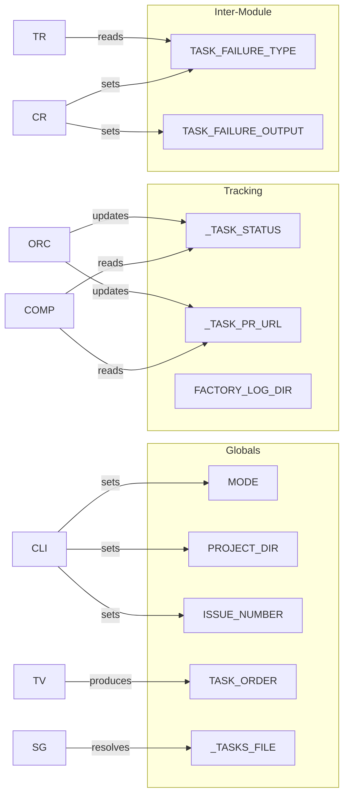

# Components

Dark Factory comprises 17 Bash modules totaling approximately 4,000 lines. Each module focuses on a specific responsibility.

## Module Reference

### Entry Point

#### run-factory.sh

The main entry point. Sources all modules, parses arguments, sets up the cleanup trap, and routes to the appropriate mode handler.

Key responsibilities:
- Resolve FACTORY_DIR (handles symlinks)
- Source all lib/*.sh modules
- Acquire project lock
- Set up EXIT trap for cleanup
- Route to issue, discover, spec, or interactive mode
- Initialize log directory
- Coordinate resume detection
- Invoke orchestrator

### Core Pipeline

#### cli.sh

Argument parsing and mode resolution.

Exports:
- `MODE` - One of: help, issue, discover, spec, interactive
- `ISSUE_NUMBER` - GitHub issue number (--issue mode)
- `SPEC_NAME` - Spec directory name (spec mode)
- `PROJECT_DIR` - Absolute path to target project
- `SKIP_LOCK` - Skip lock acquisition flag

Functions:
- `parse_args()` - Parse command-line arguments
- `show_help()` - Display usage information

#### spec-gen.sh

Fetches PRD from GitHub, invokes Claude for spec generation, validates output, and runs the review loop.

Functions:
- `generate_and_review_spec()` - Main entry: fetch PRD, generate, validate, review loop

Internal helpers:
- `_fetch_prd()` - Fetch issue title and body via gh CLI
- `_build_spec_prompt()` - Construct prompt with inlined prd-to-spec skill
- `_run_spec_generation()` - Invoke Claude with retry for transient errors
- `_run_spec_review()` - Invoke spec-reviewer agent
- `_extract_review_score()` - Parse score from review output
- `_fix_blocking_issues()` - Re-invoke Claude to fix review findings
- `_report_failure()` - Comment failure on GitHub issue

#### task-validator.sh

Validates task graph structure and performs topological sort.

Functions:
- `validate_tasks()` - Check required fields, dangling deps, circular deps
- `topological_sort()` - Return task_ids in valid execution order

Validation checks:
- Required fields: task_id, title, depends_on, acceptance_criteria, tests_to_write
- No dangling dependency references
- No circular dependencies

#### task-runner.sh

Executes a single task: branch creation, prompt building, Claude invocation, auto-fix, quality gate, and retry with failure-specific context.

Functions:
- `run_task()` - Execute task with retry loop

Internal helpers:
- `_get_task_json()` - Look up task by ID
- `_map_complexity()` - Set model and turn budget based on complexity
- `_create_feature_branch()` - Create feat/<task-id> from staging
- `_build_task_prompt()` - Construct initial task prompt
- `_build_retry_prompt()` - Add failure context for retries
- `_invoke_claude()` - Run Claude in background with spinner
- `_run_auto_fix()` - Format and lint (non-fatal)
- `_run_quality_gate()` - Run pnpm quality

Failure types handled:
- `max_turns` - Continue from partial work
- `quality_gate` - Show failing checks
- `code_review` - Feed reviewer findings back
- `agent_error` - Include git log context
- `no_changes` - Prompt to verify file paths

#### code-review.sh

Fresh-context code review and PR management.

Functions:
- `review_task()` - Review completed task, create PR based on verdict

Internal helpers:
- `_build_review_prompt()` - Construct review prompt (initial or follow-up)
- `_invoke_review()` - Run Claude with limited toolset
- `_parse_verdict()` - Extract APPROVE/REQUEST_CHANGES/NEEDS_DISCUSSION
- `_build_pr_body()` - Construct PR description
- `_create_pr()` - Push branch, create PR via gh
- `_enable_auto_merge()` - Enable squash auto-merge
- `_post_review_comment()` - Post findings for NEEDS_DISCUSSION

#### orchestrator.sh

Main execution loop: iterates tasks in dependency order, manages circuit breakers, waits for upstream PR merges.

Functions:
- `execute_tasks()` - Main loop over TASK_ORDER

Internal helpers:
- `_check_circuit_breakers()` - Task count, runtime, consecutive failures
- `_check_dependencies()` - Verify all deps succeeded
- `_wait_for_dependency_prs()` - Poll until upstream PRs merge
- `_execute_single_task()` - Run task through run -> review -> PR pipeline

Global state:
- `_TASK_STATUS` - Associative array: task_id -> success|failure|skipped
- `_TASK_PR_URL` - Associative array: task_id -> PR URL

#### completion.sh

Post-execution: resume detection, summary, issue management, PR merge waiting, docs update, cleanup.

Functions:
- `check_resume()` - Detect prior runs, prompt user
- `get_resume_context()` - Get commits ahead of staging for a task branch
- `print_summary()` - Display execution summary
- `manage_issue()` - Close or comment on GitHub issue
- `wait_for_all_pr_merges()` - Poll all task PRs until merged
- `cleanup_branches()` - Delete merged feature branches
- `cleanup_spec()` - Remove spec directory and commit
- `cleanup_logs()` - Remove log directory
- `run_completion()` - Orchestrate full completion sequence (includes docs update)

#### docs-update.sh

Documentation update: invokes Claude to update /docs and write ADR(s) after successful pipeline runs.

Functions:
- `update_project_docs()` - Update docs and write ADR(s); non-fatal on failure

Internal helpers:
- `_get_last_documented_commit()` - Read `<!-- last-documented: <sha> -->` from docs/README.md
- `_build_docs_prompt()` - Construct prompt with PRD, spec, tasks, and git diff context

Behavior:
- Reads `<!-- last-documented: <sha> -->` marker from docs/README.md to scope the diff
- Gathers context: PRD body (when ISSUE_NUMBER set), spec/tasks files, git diff
- Invokes Claude to update existing docs and write ADR(s) to docs/decisions/
- Commits changes to staging with message "docs: update documentation and write ADR(s)"
- Non-fatal: logs a warning on failure, pipeline continues

### Infrastructure

#### utils.sh

Logging, slug generation, temp files, background process tracking.

Functions:
- `log_info()`, `log_warn()`, `log_error()`, `log_success()`, `log_usage()`, `log_header()` - Logging
- `slugify_title()` - Convert string to filesystem-safe slug
- `spin()` - Display spinner while background process runs
- `factory_mktemp()` - Create temp file in FACTORY_TMP_DIR
- `register_bg_pid()` - Track background process for cleanup
- `init_log_dir()` - Initialize log directory for a run
- `write_status()`, `write_pr_map()`, `read_completed_tasks()` - Log file I/O

#### lock.sh

Directory-based project locking with stale detection.

Functions:
- `acquire_lock()` - Acquire exclusive lock for a project directory
- `release_lock()` - Release lock (safe to call multiple times)

Lock path is derived from SHA-256 hash of project directory, stored in /tmp.

#### repository.sh

Branch management for develop/staging model.

Functions:
- `setup_staging()` - Create develop and staging branches if missing
- `reconcile_staging_with_develop()` - Fast-forward or merge staging
- `safe_checkout_staging()` - Switch to staging (requires clean tree)
- `setup_branch_protection()` - Set GitHub branch protection via gh API
- `commit_deployed_configs()` - Commit factory configs to staging
- `commit_spec_to_staging()` - Commit spec directory before task execution

#### usage.sh

API usage monitoring and rate limit handling.

Functions:
- `check_usage_and_wait()` - Pause if approaching rate limits
- `check_time_circuit_breaker()` - Enforce runtime limit
- `is_rate_limit_error()` - Detect rate limit in Claude output
- `wait_for_claude_available()` - Wait for rate limit reset
- `check_claude_rate_limit()` - Pre-flight availability check

Monitors both 5-hour and 7-day usage windows with hourly pacing.

#### scaffolding.sh

Create missing progress-tracking files via Claude.

Functions:
- `ensure_scaffolding()` - Check and create claude-progress.json, feature-status.json, init.sh

#### config-deployer.sh

Deploy factory-owned configs to target projects.

Functions:
- `deploy_factory_configs()` - Deploy quality-gate.yml, .stryker.config.json, .dependency-cruiser.cjs, merge package.scaffold.json

Never overwrites existing files.

#### settings.sh

Intentionally empty. Settings are applied per-invocation via `--settings` flag.

### Extensions

#### multi-prd.sh

Multi-PRD discovery and dispatch.

Functions:
- `discover_and_process_prds()` - Find open PRD issues, offer sequential/parallel execution
- `sequential_execution()` - Process PRDs one at a time
- `parallel_worktree_execution()` - Process PRDs in parallel via git worktrees

## State Flow

## Complexity Mapping

Tasks declare a complexity level that determines model and turn budget:

| Complexity | Model | Max Turns |
|------------|-------|-----------|
| simple | Haiku | 40 |
| standard | Sonnet | 60 |
| complex | Opus | 80 |

Spec generation always uses Opus with 80 turns. Code review uses Sonnet with 30 turns.
