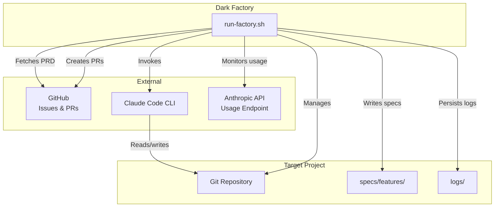
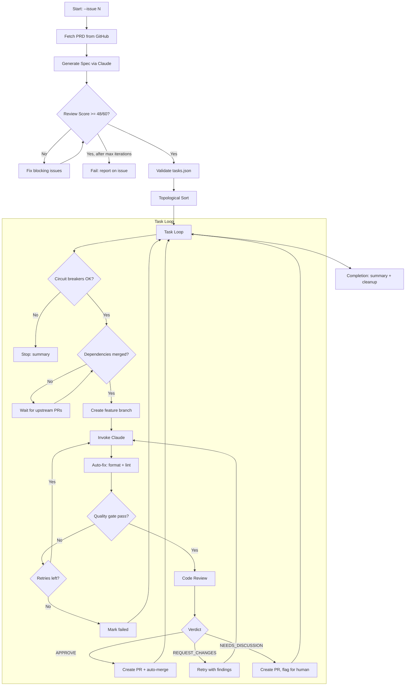
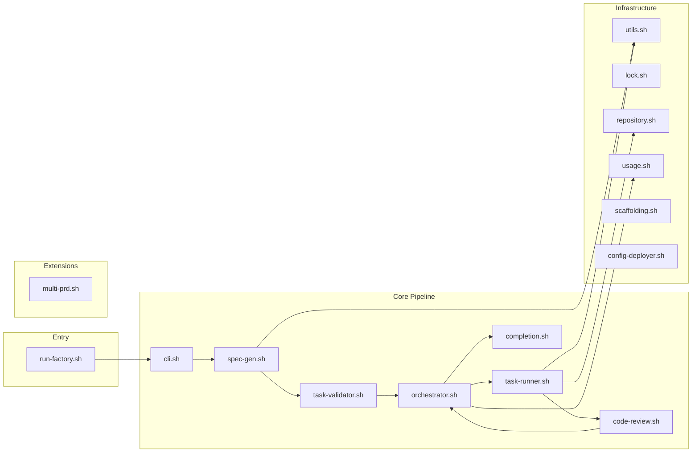

# Architecture Overview

Dark Factory is a Bash-based pipeline that orchestrates Claude AI to transform product requirements into merged code changes.

## System Context



Dark Factory operates on a target project, invoking Claude to make code changes while managing branches, PRs, and quality gates.

## Execution Flow



## Branch Strategy

The pipeline uses a three-tier branching model:

```
main
  |
  +-- develop
        |
        +-- staging (branch protection)
              |
              +-- feat/task-01-setup-auth
              +-- feat/task-02-user-model
              +-- feat/task-03-api-routes
```

- **staging**: Protected branch requiring Quality Gate checks to pass; PRs do not need to be up-to-date with base before merging (allows parallel merges)
- **Feature branches**: Created from staging for each task, PRs merge back to staging
- **develop/main**: Manually promoted after features stabilize on staging

## Module Architecture

All modules source into a single Bash process, sharing state via global variables and associative arrays:



See [Components](./components.md) for detailed module responsibilities.

## Key Design Decisions

### Pure Bash

No runtime dependencies beyond standard CLI tools. This simplifies deployment and avoids version conflicts with target projects that may use Node, Python, or other runtimes.

### Module Sourcing

All modules share a single process. This enables:
- Global state continuity (associative arrays for task status, PR URLs)
- Shared utility functions without subprocess overhead
- Single cleanup trap for guaranteed resource release

### Spec-First Workflow

The pipeline refuses to execute tasks until:
1. PRD fetched successfully
2. Spec generated and validated
3. tasks.json passes schema validation
4. Dependency graph is acyclic
5. Review score meets threshold

This front-loads failures to the cheap spec phase rather than expensive code generation.

### Dependency-Aware Execution

Tasks declare dependencies. The orchestrator:
1. Topologically sorts the task graph
2. Waits for upstream PRs to merge before starting downstream tasks
3. Proactively updates stale dependency branches (runs `gh pr update-branch` when a PR's merge state is BEHIND)
4. Pulls latest staging after merges to avoid conflicts

### Fresh-Context Review

Code reviews run in separate Claude sessions with only the diff visible. This prevents the reviewer from being biased by implementation context or debugging history.

### Non-Fatal Defaults

Several operations fail gracefully:
- API usage monitoring (proceeds without pacing if unavailable)
- Config deployment (warns but continues if files exist)
- Branch protection setup (requires admin access, warns if missing)

### Staging Restoration

After each task completes (success or failure), the orchestrator calls `_restore_staging()` to check out the staging branch. This prevents the repository from being left on a feature branch between tasks, which would cause the next task's branch creation to start from the wrong base.

As a safety net, the `cleanup()` EXIT trap in `run-factory.sh` also checks out staging on all exit paths (normal exit, errors, signals). This catches cases where the orchestrator did not run or was interrupted mid-task.

### Guaranteed Cleanup

The EXIT trap in `run-factory.sh` ensures:
- Staging branch restoration (prevents leaving repo on a feature branch)
- Lock release
- Background process termination
- Temp directory removal
