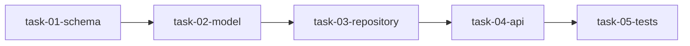
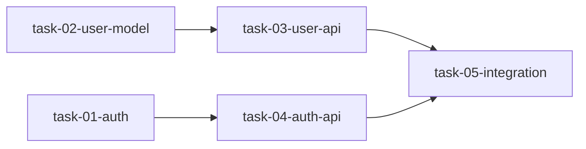

# Task JSON Schema

Tasks are defined in `tasks.json` within each spec directory (`specs/features/<slug>/tasks.json`).

## Structure

```json
[
  {
    "task_id": "task-01-user-model",
    "title": "Create User model and repository",
    "description": "Implement the User entity...",
    "complexity": "standard",
    "files": [
      "src/domain/User.ts",
      "src/repositories/UserRepository.ts"
    ],
    "acceptance_criteria": [
      "User entity has id, email, passwordHash, createdAt fields",
      "UserRepository implements create, findById, findByEmail"
    ],
    "tests_to_write": [
      "User.test.ts: validates email format",
      "UserRepository.test.ts: creates and retrieves user"
    ],
    "depends_on": []
  }
]
```

## Required Fields

| Field | Type | Description |
|-------|------|-------------|
| `task_id` | string | Unique identifier. Used for branch names (`feat/<task_id>`) and dependency references. |
| `title` | string | Human-readable task title. Used in PR titles and prompts. |
| `depends_on` | string[] | Array of task_ids this task depends on. Empty array if no dependencies. |
| `acceptance_criteria` | string[] | Conditions that must be met for the task to be complete. |
| `tests_to_write` | string[] | Test files and what they should verify. Format: `filename.test.ts: description` |

## Optional Fields

| Field | Type | Default | Description |
|-------|------|---------|-------------|
| `description` | string | `""` | Detailed task description. Included in Claude prompts. |
| `complexity` | string | `"standard"` | Task complexity: `simple`, `standard`, or `complex`. Maps to model and turn budget. |
| `files` | string[] | `[]` | Files to create or modify. Guides Claude on scope. |

## Complexity Levels

| Complexity | Model | Max Turns | Use Case |
|------------|-------|-----------|----------|
| `simple` | Haiku | 40 | Config changes, small utilities, type definitions |
| `standard` | Sonnet | 60 | Most implementation work, CRUD operations |
| `complex` | Opus | 80 | Algorithmic work, complex integrations, debugging |

## Dependency Graph

Tasks form a directed acyclic graph (DAG) via `depends_on`. The orchestrator:

1. Validates no circular dependencies exist
2. Topologically sorts tasks
3. Executes in dependency order
4. Waits for upstream PRs to merge before starting downstream tasks

### Example Dependency Graph

```json
[
  {"task_id": "task-01-schema", "depends_on": []},
  {"task_id": "task-02-model", "depends_on": ["task-01-schema"]},
  {"task_id": "task-03-repository", "depends_on": ["task-02-model"]},
  {"task_id": "task-04-api", "depends_on": ["task-03-repository"]},
  {"task_id": "task-05-tests", "depends_on": ["task-04-api"]}
]
```



### Parallel-Ready Graph

```json
[
  {"task_id": "task-01-auth", "depends_on": []},
  {"task_id": "task-02-user-model", "depends_on": []},
  {"task_id": "task-03-user-api", "depends_on": ["task-02-user-model"]},
  {"task_id": "task-04-auth-api", "depends_on": ["task-01-auth"]},
  {"task_id": "task-05-integration", "depends_on": ["task-03-user-api", "task-04-auth-api"]}
]
```



Tasks 01 and 02 can execute in parallel. Task 05 waits for both 03 and 04 to merge.

## Validation Rules

The pipeline validates tasks.json before execution:

### Required Fields Check

Every task must have:
- Non-empty `task_id`
- Non-empty `title`
- `depends_on` array (can be empty)
- `acceptance_criteria` array (can be empty)
- `tests_to_write` array with at least one entry

### Dangling Reference Check

All task_ids in `depends_on` must exist in the task list.

### Circular Dependency Check

The dependency graph must be acyclic. Cycles are detected via DFS.

### Validation Errors

```
[ERROR]   Task validation failed (3 errors):
[ERROR]     - Task task-02-model: missing tests_to_write
[ERROR]     - Task task-03-api: depends on non-existent task task-99-missing
[ERROR]     - Circular dependency: task-04 -> task-05 -> task-04
```

## Best Practices

### Task Granularity

- Each task should be completable in 40-80 Claude turns
- Prefer more smaller tasks over fewer large tasks
- Tasks should produce testable, reviewable units

### Acceptance Criteria

- Be specific: "User entity has id, email, passwordHash fields" not "User entity is complete"
- Include validation requirements: "Email must be validated against RFC 5322"
- Include error cases: "Returns 404 when user not found"

### Test Requirements

- Match tests to acceptance criteria 1:1 minimum
- Include edge cases explicitly: "handles empty input", "handles duplicate email"
- Specify assertion type: "asserts response status 201", "throws ValidationError"

### Dependencies

- Minimize dependency chains (fewer levels = faster execution)
- Group independent tasks to enable parallel PR creation
- Dependencies should reflect code dependencies, not preference
